<br/>

# hello, i'm **Jasmine** („• ֊ •„)੭*

`third year bscs student` · `aspiring data analyst professional` · `based in the PH`

---

### `// github stats`

<div align="center">


</div>


---
<table><tr>
<td>
  
### `// tech stack`

**frontend**


**backend**


**tools & infra**


### `// connect with me!` 

[](mailto:jasminerollon@gmail.com)
[](https://linkedin.com/in/jasminerollon)

</td>
<td align="right">
  
```
  ⠀⠀⠀⠀⠀⠀⠀⠀⠀⣀⣤⢤⣤⡄⣤⡀⠀⠀⠀⠀⠀⠀⠀⠀
⠀⠀⠀⠀⠀⠀⢀⣴⠮⠋⠈⠐⠀⠃⠛⠸⢑⢄⠀⠀⠀⠀⠀⠀
⠀⠀⠀⠀⠀⣠⡛⢂⣀⢀⣴⠀⠓⠀⢷⣄⣀⠘⢷⡀⠀⠀⠀⠀
⠀⠀⠀⠀⣾⠃⠀⣨⣿⣿⣷⣤⡀⠀⠼⠿⣇⠀⣀⠛⣦⠀⠀⠀
⠀⠀⢀⡜⣃⡀⠉⡉⠉⣿⠉⠀⠀⣀⠀⠀⠈⠂⠙⠃⠋⠽⣄⠀
⠀⣠⣞⡘⠘⠁⠀⠀⠀⠃⠀⠀⠀⠻⠁⠀⠶⠄⠀⠀⠀⠉⣗⢳
⠠⣟⡤⡖⠀⠀⠀⠀⠀⠀⢀⠘⠁⠀⠀⠀⠐⠆⠀⠀⠀⢰⢓⡺
⠀⠳⠷⢧⡀⢀⠀⢠⣠⣰⣆⠦⠀⠀⠀⠀⢀⢷⡂⡔⣥⠟⠉⠁
⠀⠀⠀⢀⠟⠛⠛⣿⠉⠉⢉⢿⣷⡿⠶⠖⠋⠉⡟⠋⠉⡆⠀⢀
⠀⠀⠀⡆⠀⣠⡼⠁⣠⡔⢷⢅⣿⠧⣠⣀⣀⠀⢷⣄⣰⠁⠀⠀
⠀⠀⠀⣣⠞⠋⠀⡼⠉⠀⠉⠀⠿⠿⠛⢁⣼⠆⠀⠩⠙⠷⣄⠀
⠀⠀⣸⠉⡄⠀⠸⣯⣠⡴⠞⢙⣧⣡⣾⠞⠁⠀⠀⡇⠀⠀⠸⡆
⠀⢸⣟⠀⠸⡀⠀⠈⠁⢀⣴⠟⢗⠽⣧⡄⣀⡀⠀⢇⠀⢠⡼⠀
⠀⠈⢿⡄⢀⠆⠀⠀⠀⣿⣯⣍⣀⣠⣤⣀⢀⠘⣧⠈⣖⠟⠁⠀
⠀⠀⠀⠛⡾⡀⠀⠀⠀⠈⠛⠛⠋⠉⣿⠏⡿⣮⡿⢨⠃⡇⠀⠀
⢀⡠⠒⠉⠀⠘⡆⠀⠀⠀⣀⣀⣀⣴⣳⠽⠗⠋⠀⢸⢠⠃⠀⠀
⠎⠀⠀⠀⢀⣴⠃⠀⣠⡟⠋⣽⠉⠉⠀⠀⠀⠀⣀⠜⢧⣤⣀⠀
⢇⡀⠀⡰⠵⠃⠀⠀⢿⡀⢨⣗⣄⣀⠀⠀⠀⡜⠀⠀⠀⠉⠹⣗
⠀⠀⠀⢿⡇⠀⠀⠀⠈⠓⠒⢨⠉⠉⣷⡀⢰⠀⠀⠀⠰⠄⠴⠃
⠀⠀⠀⠈⠷⠤⠆⠀⢀⣴⣺⣍⡼⠴⠟⠁⠀⡆⠀⠀⠀⠀⠀⠀
⠀⠀⠀⠀⠀⠀⠀⠀⢸⣟⣎⠀⠀⠀⠀⠀⠔⠀⠀⠀⠀⠀⠀⠀
⠀⠀⠀⠀⠀⠀⠀⠀⠀⠉⠋⠑⢆⠀⠀⠀⠀⠀⠀⠀⠀⠀⠀⠀
⠀⠀⠀⠀⠀⠀⠀⠀⠀⠀⠀⠐⠂⠀⠀⠀⠀⠀⠀⠀⠀⠀⠀⠀
```
</td>
</tr></table>
